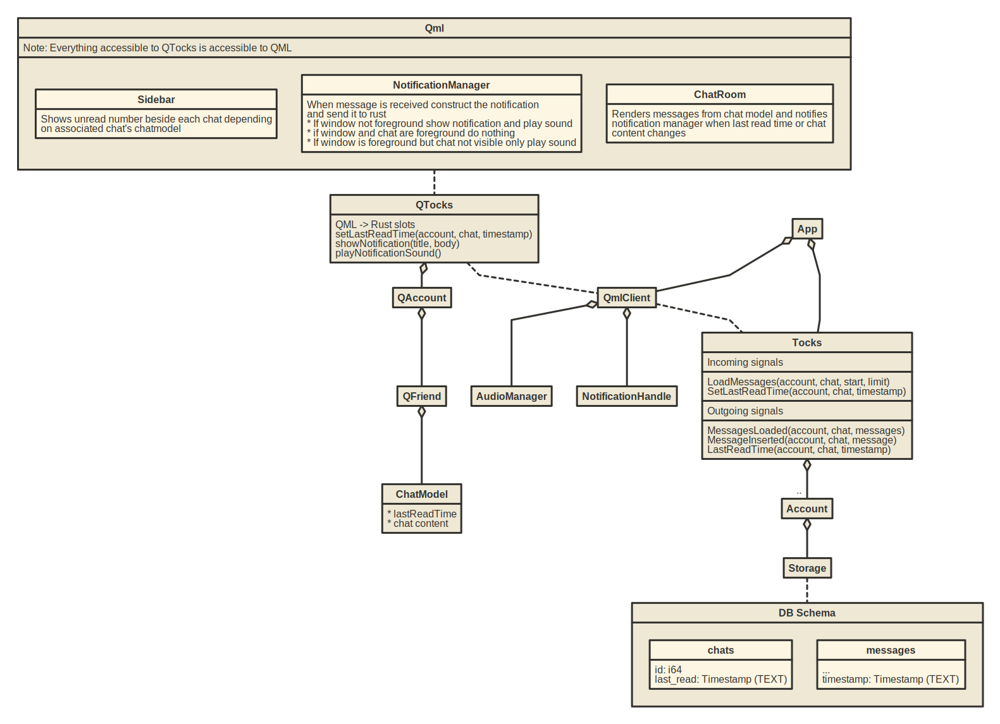

# Notification design
## Desired behavior

* Sidebar
    * Show number of unread messages since last read
    * Possibly show last message text
* General
    * Notify on new message if chat is not visible
* Notification
    * Only shows if window not visible
    * Single account
        * Title
            * N messages received from \<chat>
            * Message received from \<chat>
            * N messages received from M chats
        * Body
            * If all messages are from a single chat
                * Show message content as body
            * If messages are from different chats
                * Show which chats to check

            * Show elided messages
                * elision can be on one message or many depending on message length
    * If multiple accounts are logged in...
        * If all notifications for a single account show "for account \<name>" in title
        * Otherwise replace message body with the given title for each chat
    * Examples
        *     Message received from sphaerophoria
              Hello!
        *     Message received from sphaerophoria
              Hello this is a really long messa...
        *     Mesasge received from sphaerophoria for tocks-user
              Hello!
        *     2 messages received from sphaerophoria
              Hello!
              How are you?
              Hello this is a real...
        *     N messages received from sphaerophoria for tocks-user
              Hello!
              How are you?
        *     Messages received for multiple accounts
              Message received from sphaerophoria for tocks-user
              2 messages received from sphaerophoria for tocks-user-2
* Notification sound
    * Only plays if chat not visible
* Future...
    * Groups have the same behavior

## Implementation

* Last read time is stored in the DB as part of the chat table
* On login all messages since last read time are sent to the tocks client immediately along with the last read time for each chat. If people ignore messages an absurd amount this could start to get expensive
* QML marks as read when a chat is opened
    * QML owns notification construction. This allows us to easily determine visibility of window/chat
    * With a debounce period to avoid extra code during initialization. Debouncing makes sense anyways, you can't read a message in 10ms
    * QML marks as read if chat is in foreground when messages are inserted
    * QML owns read timestamps. This allows us to set the time last read from QML to avoid showing notifications while we wait for the DB to update
* QML requests notifications
    * Notification needs window visibility, account id, chat id

* ChatModel loading
  * Since we have
